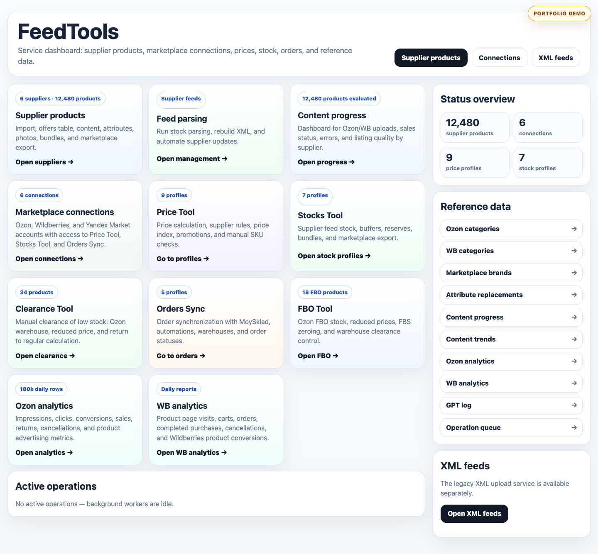
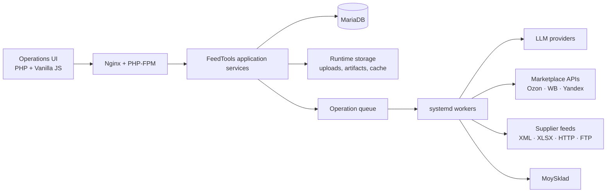

# FeedTools

> A self-hosted operations platform for supplier catalogs, marketplace content, pricing, inventory, orders, and analytics.




FeedTools grew from a feed-processing utility into a production back-office system for multichannel e-commerce. It brings supplier imports, catalog enrichment, marketplace integrations, pricing rules, stock synchronization, order workflows, and product analytics into one interface.

This repository is a portfolio case study of a real production application. Credentials, customer and supplier data, marketplace exports, database dumps, generated media, and runtime artifacts are intentionally excluded.

## Highlights

- **Supplier catalog workspace** — import XML/XLSX feeds, normalize offers, edit content in bulk, manage bundles, images, attributes, categories, and brands.
- **Marketplace integrations** — workflows for Ozon, Wildberries, and Yandex Market, with connection-scoped tools and status tracking.
- **Pricing and inventory automation** — configurable price calculations, promotion handling, supplier stock parsing, buffers, reserves, and marketplace uploads.
- **Order synchronization** — marketplace order ingestion, MoySklad mapping, warehouse and status rules, scheduling, and run history.
- **AI-assisted catalog operations** — pluggable LLM providers for categorization, text improvement, attribute enrichment, image workflows, and structured content operations.
- **Analytics** — product performance, content readiness, supplier progress, marketplace metrics, and employee contribution dashboards.
- **Background processing** — a database-backed operation queue, live progress, cancellation, artifacts, logs, and dedicated worker lanes.
- **Bilingual UI** — switchable Russian and English interfaces while preserving source product and marketplace data.
- **Production deployment** — Nginx, PHP-FPM, MariaDB, systemd workers, health checks, retention jobs, and repeatable deployment scripts.

## Architecture



The web layer creates short database records for long-running operations. Dedicated workers claim those operations, update progress, write artifacts, and keep expensive external API work outside the request lifecycle. Separate worker lanes prevent catalog, price, marketplace-data, and supplier-feed jobs from blocking one another.

## Technology

| Area | Implementation |
| --- | --- |
| Backend | PHP 8.3+, PDO, cURL, XMLReader, GD |
| Frontend | Server-rendered PHP, semantic HTML, custom CSS, Vanilla JavaScript |
| Database | MariaDB / MySQL |
| Spreadsheet processing | PhpSpreadsheet, disk-backed SQLite cell cache |
| Background jobs | Database queue, CLI workers, systemd services |
| Integrations | Ozon, Wildberries, Yandex Market, MoySklad, supplier XML/XLSX feeds |
| AI providers | OpenAI Responses API and OpenAI-compatible providers, including Yandex, Gemini, GigaChat, MWS, and Cloud.ru |
| Infrastructure | Ubuntu, Nginx, PHP-FPM, rsync deployment, health and preflight checks |

## Repository map

```text
app/        domain services, integrations, operation registry, configuration
app/operations/
            asynchronous catalog and content operations
public/     web entry points and UI assets
bin/        workers, schedulers, diagnostics, imports, and deployment helpers
deploy/     example Nginx, PHP, systemd, and logrotate configuration
docs/       architecture notes and operational runbooks
analysis/   offline catalog-analysis utilities (generated results are excluded)
storage/    runtime directory placeholders; production data is excluded
```

## Local setup

### Requirements

- PHP 8.3 or newer
- MariaDB/MySQL 10.6 or newer
- Composer
- PHP extensions listed in [`README_DEPLOY.md`](README_DEPLOY.md)

### Install

```bash
composer install
cp .env.example .env
```

Configure the database and the integrations you want to use in `.env`, then initialize writable runtime directories:

```bash
composer run init-runtime
composer run preflight
```

For local development:

```bash
php -S 127.0.0.1:8080 -t public
```

Open `http://127.0.0.1:8080`.

> The public portfolio repository does not include the production database schema or a data dump. The application is designed around an existing FeedTools database and its self-initializing integration tables. Production and supplier data are deliberately kept outside Git.

## Configuration and security

- Secrets live in `.env` or a local override and are ignored by Git.
- The web interface supports application-level Basic authentication.
- Marketplace tokens and LLM keys are never required in source files.
- Runtime uploads, reports, caches, and generated artifacts are outside version control.
- External calls have configurable timeouts, retries, TLS verification, and provider-specific credentials.
- Retention jobs remove short-lived operational and LLM request data.

Use [`.env.example`](.env.example) as the configuration reference. Never commit a populated `.env` file.

## Quality and operations

```bash
composer run lint
composer run preflight
composer run db-doctor
```

The production deployment includes health checks, PHP syntax validation, database diagnostics, systemd service checks, and a smoke-test workflow. See [`README_DEPLOY.md`](README_DEPLOY.md) for the server layout.

## Notes for reviewers

FeedTools demonstrates work across product design, backend architecture, marketplace APIs, background processing, operational tooling, AI integration, and production infrastructure. The codebase is intentionally framework-light: domain behavior is visible directly in application services and operation handlers rather than hidden behind a large framework abstraction.

No open-source license is granted. The source is published for portfolio review and evaluation.
